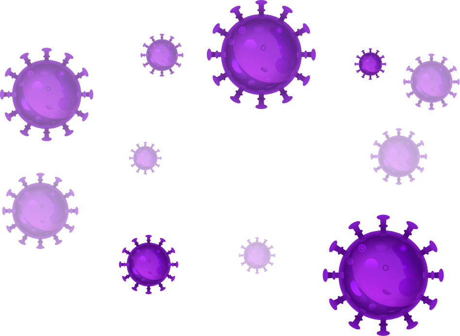
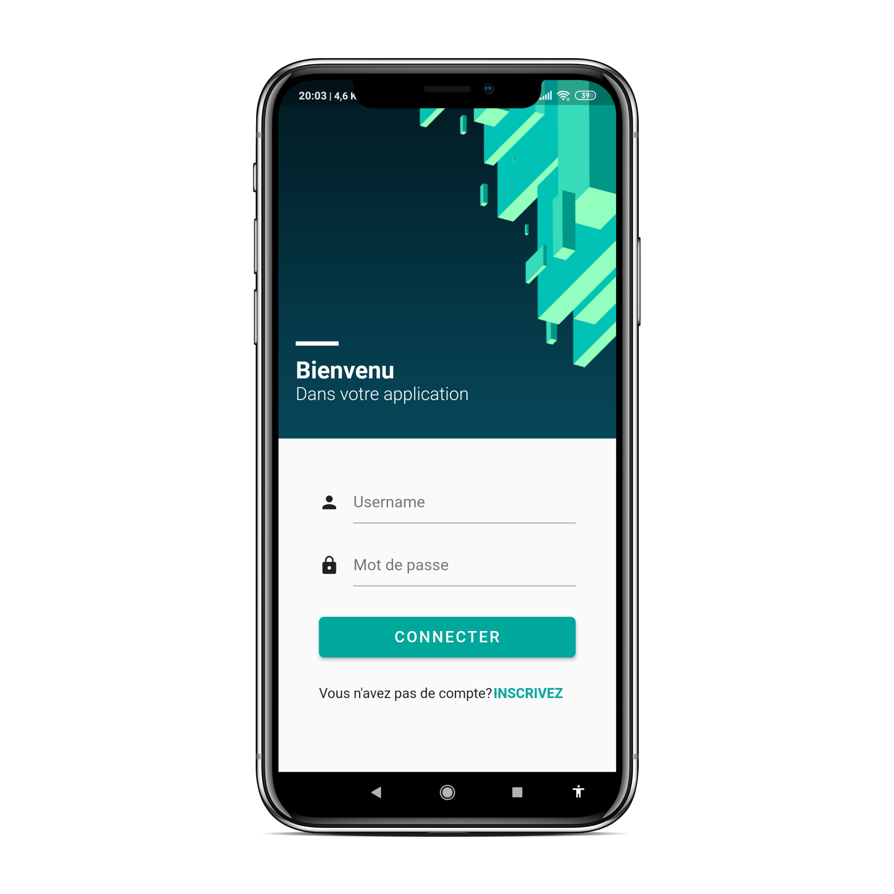
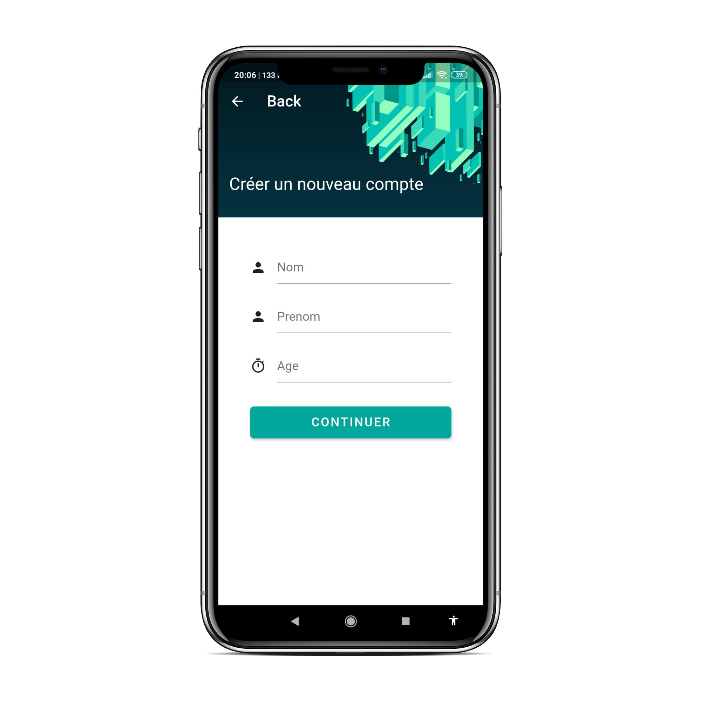

# Covid 19 Application 
> A Flutter project,
> is a mobile application offering the user the possibility to enter his personal information and his symptoms, this information is consulted by a doctor who will determine the seriousness of his situation.
## Installation

- Not yet

## Testing
Clone the source locally.
On a working flutter environment:
  
```sh
$ flutter packages get
```
then :
  
```sh
$ flutter run 
```
(may take time in first run)

## Preview


### Main_Page


### Info_pages 



## Features

- [x] Taking personal information
- [x] Main page
- [ ] Doctor Dashboard

## Authors
- Iheb Nassim Aouadj
- SafiEddine Rihani

## Contributions

Pull requests are welcome. For major changes, please open an issue first to discuss what you would like to change.

Please make sure to update tests as appropriate.
